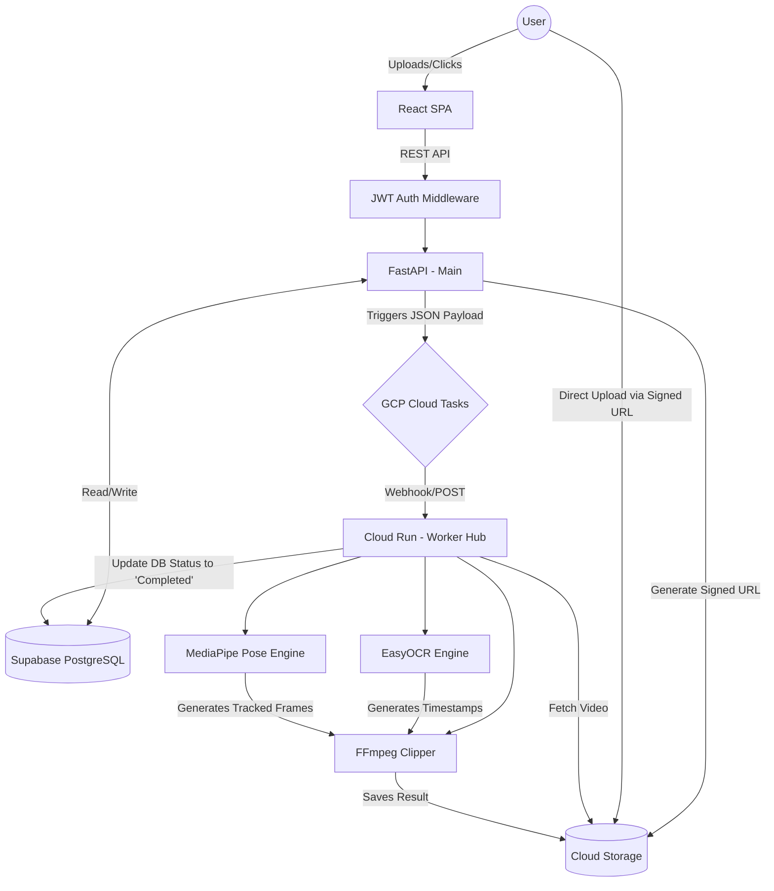

# System Architecture & Design

## 1. High-Level Architecture
The platform follows a decoupled, microservices-oriented architecture suitable for AI-heavy workloads. 
- **Frontend Layer:** A Single Page Application (SPA) built in React and Vite. Hosted on Vercel or Firebase Hosting.
- **API Gateway / Engine:** FastAPI providing RESTful endpoints, JWT Auth, and routing for user requests.
- **Asynchronous Workers:** Processing full match highlights and AI biomechanics is non-blocking. Cloud Tasks dispatches workloads to background Cloud Run worker instances.

---

## 2. Component Design & Interactions

---

## 3. Database Schema Layout Context
**PostgreSQL** acts as the singular source of truth.
*   `Users Table:` Stores profiles, hashed passwords, and roles (`admin`, `free`, `premium`, `coach`).
*   `Videos Table:` Tracks uploaded file paths, status (`processing`, `failed`, `completed`), and types (raw match vs player practice clip).
*   `Highlights/Events Table:` Relational pointers connecting a parent video with specific timestamp clips, tracking whether it's a '4', '6', or 'Wicket'.
*   `Submissions Table:` Enables student-to-coach tracking where Premium users upload clips explicitly tied to coach review workflows.

---

## 4. Specific AI Engine Modules
*   **OCR Match Highlights (`ocr_engine.py`):** Utilizes `yt-dlp` for ingress. Instead of analyzing every single frame, it scrubs effectively using a rolling median history queue to prevent scoreboard flickering from causing false positives.
*   **Biomechanics (`batting_engine.py`):** Loads a pre-trained `.task` model. Applies body landmarking against a coordinate grid. Automatically highlights physical outliers (e.g., incorrect elbow angle on a cover drive).
